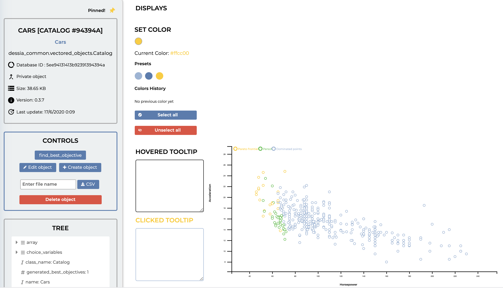
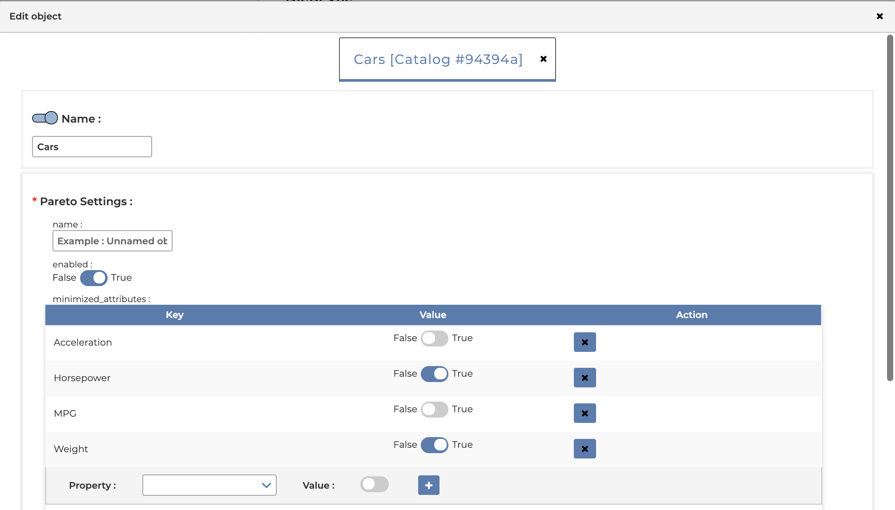
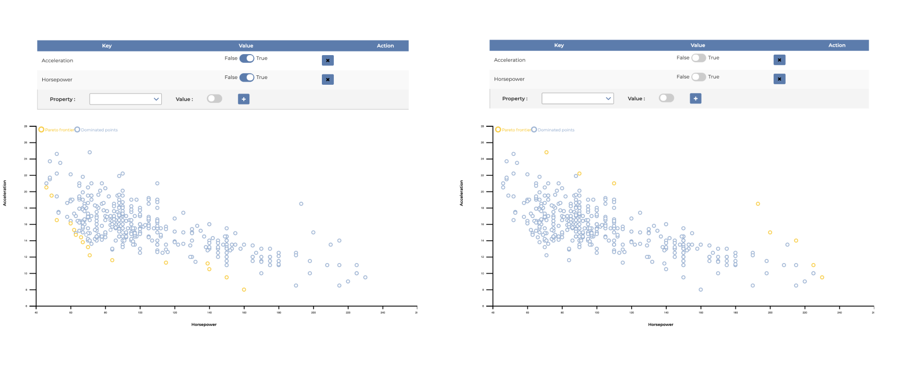
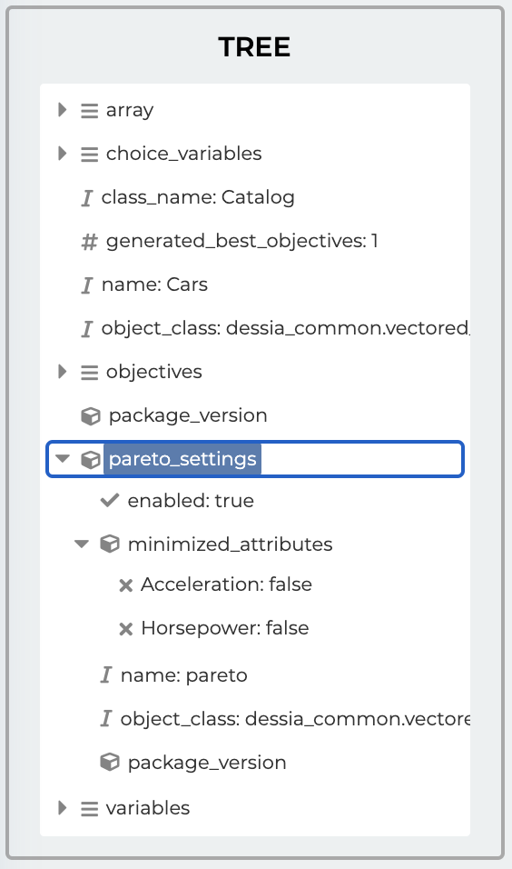
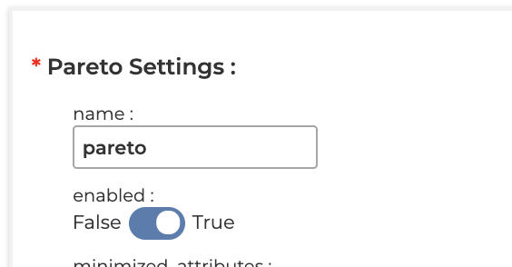
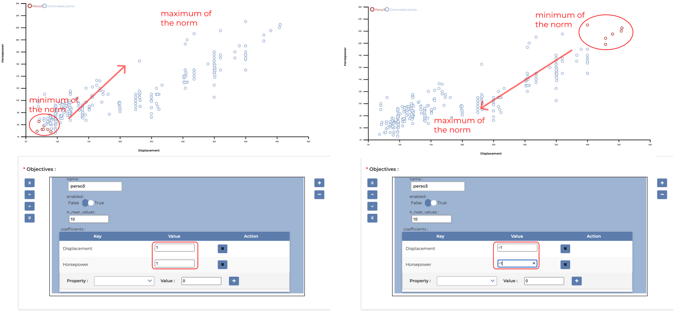
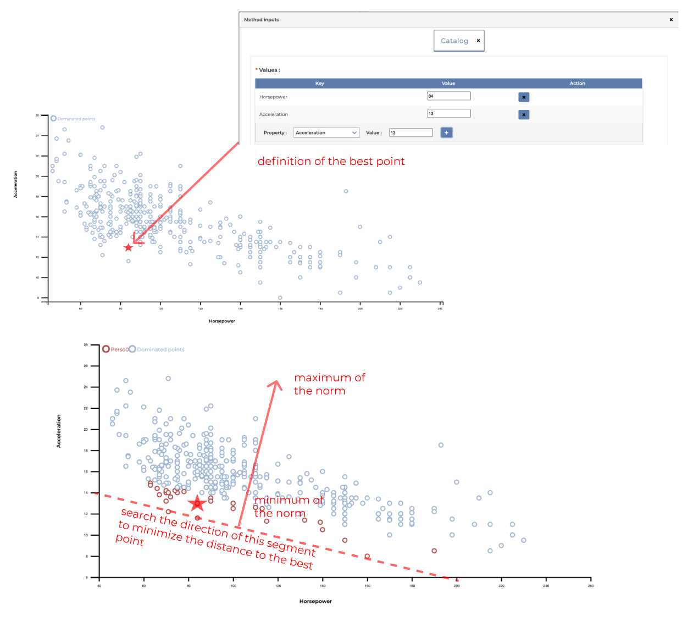
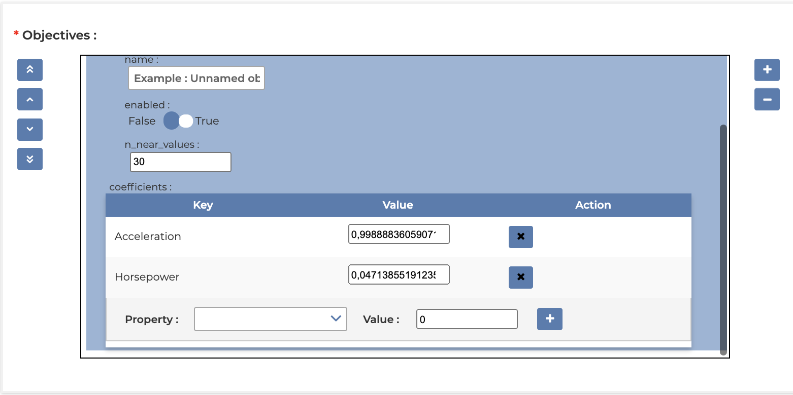

Tutorial
********

Pareto front
============

The objective is to describe the definition of a pareto front for a given dataset. The algorithm use
to define the Pareto front is describe in the following section

DessIA platform
---------------

First open your Catalog object, then clic on "Edit object" button

Then in the following windows, you can define in the "pareto settings" all parameters to define
pareto front

You can add or remove the different axis and define the axis direction search. When
this parameter is True, then the minimum of this parameter is taken, and when this
parameter is False the maximum value is chosen.

After confirm your modifications, you can check all "pareto settings" in the Tree view

In parallel you can disable the pareto front with the following check

DessIA API
----------

With the dessia_common library and with the DessIA API you can perform the same pareto front with
the following "pareto settings"

.. code-block:: python

    minimized_attributes = {'MPG': False, 'Horsepower': True, 'Weight': True, 'Acceleration': False}

    pareto_settings = ParetoSettings(minimized_attributes=minimized_attributes,
                                     enabled=True)

    catalog = Catalog(array=array,
                      variables=variables,
                      choice_variables=choice_args,
                      objectives=[objective0],
                      pareto_settings=pareto_settings,
                      name='Cars')

Define a norm
=============

In this section, we define how to describe a Norm. The following equation detail the
general view for the norm :math:`n1` for a dataset define with :math:`param1` and :math:`param2`.

.. math::

   n1 = a*param1 + b*param2

:math:`a` and :math:`b` are the parameter to define this norm

DessIA platform
---------------

In the following figure we define :math:`a=1` and :math:`b=1` with :math:`param1` the Horsepower axis
and :math:`param2` the Displacement axis

Search the best norm
====================

In this section, we want to obtain the more realistic norm toward engineers feedback.

DessIA platform
---------------

With the find_best_objective button you can define an interest point as follow

then with the edit button you can read the norm parameters

