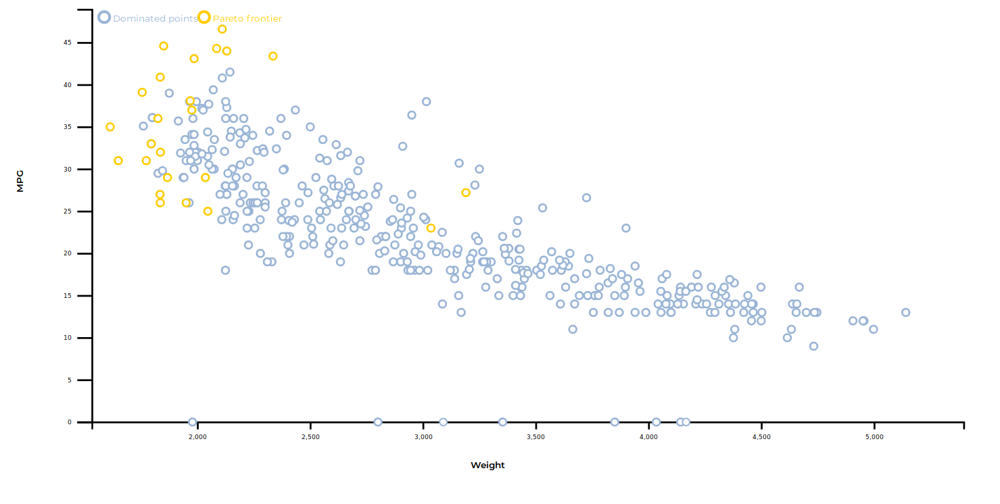

Vectored Objects
****************

Introduction
============

DessIA's Vectored Object is a module that gives you tools and models to handle your structured datasets.
Its aim is to provide a first, generic approach to MBSE's by translating your data to generic models.
These generic models implements computation and posttreatment tools such as Pareto frontiers or ratings systems.

Use Vectored Objects
====================

.. autoclass:: dessia_common.vectored_objects.VectoredObject

.. autoclass:: dessia_common.vectored_objects.Catalog

From a .csv document, you can build one or several catalog objects. These objects gather every Vectored Object build from each line of the .csv file.

The .csv should be formatted as follows :

::

    param1,param2,param3
    value11,value21,value31
    value12,value22,value32

First line defines the list of attributes that will be known by a VectoredObject. Each following line represent a value and hence a VectoredObject with corresponding values for parameters defined throughout the line.

.. warning::

    Temporary : VectoredObject is a generic class and need to be inherited in order to successfully create instances. One should create a new class inheriting VectoredObject and overload _init_variables and _editable_variables according to incoming data.

As an example, here is the definition of a VectoredObject picturing a car.

.. literalinclude:: ../../../vectored_objects/vectored_objects/core.py
    :pyobject: Car

Pareto Frontier
===============

Catalog objects have several attributes in order to compute pareto frontier. These are *pareto_attributes* and *minimise*. The Pareto frontier is built only using attributes that are defined in *pareto_attributes*. *minimise* is a corresponding list of boolean that gives the optimal direction for each attributes of *pareto_attributes* (minimum is True, maximum is False).

When the Pareto frontier for a catalog is being computed, we first build costs for every object in the catalog as above. The result is given to *pareto_frontier* function.

.. automethod:: dessia_common.vectored_objects.Catalog.build_costs

.. autofunction:: dessia_common.vectored_objects.pareto_frontier

.. literalinclude:: ../../dessia_common/vectored_objects.py
    :pyobject: pareto_frontier

Pareto frontier is calculated by looking at each line of the costs array. A point is efficient if and only if all of his costs are strictly lesser than those of any other point.

Objectives
==========

.. autoclass:: dessia_common.vectored_objects.Objective

Objective objects are given to catalog. These are ratings that are applied to every vectored object of the catalog.

.. automethod:: dessia_common.vectored_objects.Objective.apply

Objective is applied to each vectored object like so : 

.. math:: rating = coeff_1*value_1 + coeff_2*value_2 + ... + coeff_n*value_n

.. literalinclude:: ../../dessia_common/vectored_objects.py
    :pyobject: Objective.apply

Objective-efficient solutions are then the ones which have a minimal rating. This means :

 * Coefficients are penalties to solutions.
 * The greater a coefficient, the less efficient is a solution.
 * To search in the minimum direction of a parameter, its coefficient should be positive. In the maximum direction, its coefficient should be negative.

Display on platform
===================

Catalog has a configuration builder called *_display_angular*. It provides a configuration dictionnary that can be read into frontend platform.

.. automethod:: dessia_common.vectored_objects.Catalog._display_angular

.. literalinclude:: ../../dessia_common/vectored_objects.py
    :pyobject: Catalog._display_angular

Several datasets are defined in the configuration. Here pareto frontier and objectives

Pareto frontier
---------------

A dataset of the configuration that gathers all the points that are Pareto efficient, which means they are optimal in every given dimension.

A multidimensionnal (4 dimensions in this example) Pareto frontier where two parameters are minimised (Weight & Horsepower) and two other are maximised (Miles per Gallon & Acceleration).

Objectives
----------

Other datasets can be objective-efficient points. The *n_near_value* points for each Objective are displayed on the frontend data viewer.

.. image:: images/objective.png
    :alt: Objective-efficient points

.. warning:: Temporary : As any point can only be included in one and only dataset, objective-efficient points are prioritized against pareto-efficient points. Between objectives, the first Objective is prioratized against the second, that is prioratized against the third, and so on...

Any point that is not included in a dataset is thus declared as a **dominated point** and put in the referenced dataset.
 
Apply modification
------------------

Attributes that are used for computations of pareto and objectives can be directly modified from the platform. In the **edit section** of the Catalog object, all these attributes can be modified to alter the display : 

 * n_near_values : The n better solutions for each objective.
 * objectives : List of objectives that are to be applied to objects.
 * pareto_attributes : List of parameters that are used to compute Pareto frontier
 * minimise : Wheter each attribute defined in *pareto_attributes* should be minimized for Pareto computation

Handle data
-----------

The graph can be manipulated. Points can be selected, with different colors to create custom groups.
Axes can be changed, and points can be sorted and filtered with the *selector* section.
Afterward, these selections can be exported as .csv files using the corresponding tool in the object control part of the platform.

.. automethod:: dessia_common.vectored_objects.Catalog.export_csv

